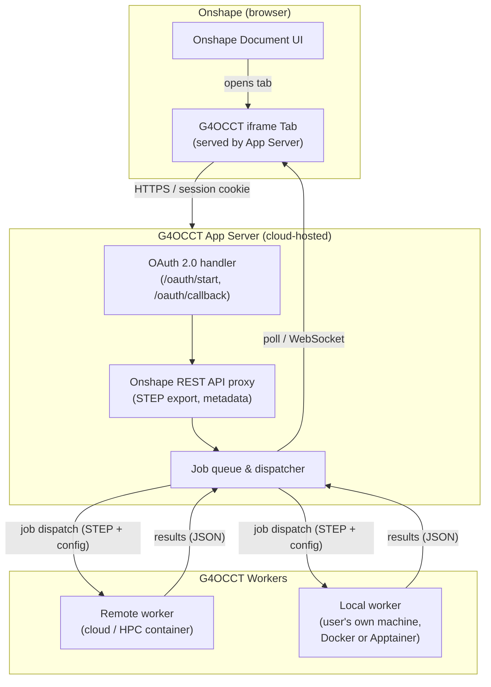

<!-- SPDX-License-Identifier: LGPL-2.1-or-later -->
<!-- Copyright (C) 2026 G4OCCT Contributors -->

# G4OCCT Onshape OAuth iframe Application — Planning Document

**Repository:** [wdconinc/G4OCCT](https://github.com/wdconinc/G4OCCT)
**Date:** 2026-03-22
**Status:** Draft

---

## 1. Overview & Goal

G4OCCT provides a compatibility layer between [Geant4](https://github.com/geant4/geant4) and
[OpenCASCADE Technology (OCCT)](https://github.com/Open-Cascade-SAS/OCCT), enabling physics
simulations to be driven directly by CAD geometry imported from STEP files.  The aim of this
application is to expose that capability **directly within the Onshape CAD environment** as an
OAuth-authenticated iframe tab, allowing physicists and engineers to trigger Geant4 simulations
from their CAD designs without ever leaving Onshape.

---

## 2. User Story

> As a Geant4 physicist using Onshape for detector design, I want to click a tab inside my
> Onshape document and launch a simulation of the current assembly or part studio geometry —
> receiving results without having to manually export STEP files, run G4OCCT locally, or manage
> file transfers.

---

## 3. Architecture Overview



### Component Responsibilities

| Component | Responsibility |
|---|---|
| **Onshape iframe Tab** | Reads document context; renders simulation controls and results |
| **App Server** | OAuth token management; Onshape REST API proxy; job dispatch |
| **Remote Worker** | Cloud- or HPC-hosted container running Geant4 + OCCT + G4OCCT |
| **Local Worker** | Docker / Apptainer container on the user's own system; connects back to the App Server to pull jobs and push results |

---

## 4. Onshape OAuth App Registration

### 4.1 Developer Portal Steps

1. Register at the [Onshape Developer Portal](https://onshape-public.github.io/docs/).
2. Create a new **OAuth application**.
3. Set the **Redirect URI** to `https://<app-server-host>/oauth/callback`.
4. Note the `CLIENT_ID` and `CLIENT_SECRET` — store securely in server environment variables,
   never in client-side code.
5. Request only necessary OAuth **scopes** (e.g., `OAuth2Read` for reading document geometry,
   `OAuth2Write` if saving results back into the document).

### 4.2 Tab / iframe Registration

- Register an **iframe Tab** in the app settings, pointing to `https://<app-server-host>/app`.
- Onshape injects context as URL query parameters when loading the iframe:
  - `documentId`
  - `workspaceId`
  - `elementId`
  - `companyId` *(optional)*

---

## 5. Authentication & OAuth Flow

The iframe operates in a browser, but token management **must be server-side** for security.

```
1. User opens the G4OCCT tab in an Onshape document.
2. iframe loads https://<app-host>/app?documentId=...&workspaceId=...&elementId=...
3. Server checks for a valid session / token for this user.
   ├─ None found → redirect (or open popup) to Onshape OAuth authorisation URL.
   │   User grants permission → Onshape redirects to /oauth/callback.
   └─ Found → proceed to step 5.
4. Server exchanges authorisation code for access + refresh tokens.
5. Tokens stored server-side (session store / DB), keyed by Onshape user ID.
6. iframe UI makes requests to the app server, authenticated by session cookie.
7. App server proxies Onshape REST API calls using the stored access token.
```

> ⚠️ **Security:** Never pass OAuth tokens to the iframe JavaScript context.
> All Onshape API calls must be made from the server backend.

---

## 6. STEP Geometry Retrieval from Onshape

Once authenticated, the app server retrieves the geometry of the active element.

**Part Studio:**

```
POST /api/partstudios/d/{documentId}/w/{workspaceId}/e/{elementId}/export
{
  "formatName": "STEP",
  "storeInDocument": false,
  "yAxisIsUp": false
}
```

**Assembly:**

```
POST /api/assemblies/d/{documentId}/w/{workspaceId}/e/{elementId}/export
{
  "formatName": "STEP",
  "flattenAssemblies": false,
  "storeInDocument": false
}
```

The returned STEP file is forwarded to a G4OCCT worker for simulation.

---

## 7. G4OCCT Worker

The simulation backend is a containerised service wrapping G4OCCT.  Two deployment modes are
supported: **remote** (cloud or HPC) and **local** (user's own machine).

### 7.1 What the Worker Does

1. Receives a STEP file (via job queue or direct HTTP POST).
2. Loads it using OCCT (`STEPControl_Reader` → `TopoDS_Shape`).
3. Constructs the Geant4 geometry using `G4OCCTSolid`, `G4OCCTLogicalVolume`, and
   `G4OCCTPlacement`.
4. Runs the configured simulation (e.g., geantino scan for geometry validation, or full physics
   run).
5. Returns results as structured JSON (hit maps, material distributions, navigation diagnostics)
   to the App Server.

### 7.2 Worker HTTP Interface (draft)

```
POST /jobs
{
  "step_data": "<base64-encoded STEP or presigned URL>",
  "simulation_config": { ... }
}

GET /jobs/{job_id}
→ { "status": "queued|running|complete|failed", "results": { ... } }
```

### 7.3 Remote Worker

Runs as a container on cloud infrastructure or an HPC cluster with a public (or
VPN-accessible) endpoint.  The App Server dispatches jobs directly to this endpoint.

### 7.4 Local Worker

Runs on the user's own machine (laptop or workstation) as a Docker or Apptainer container.
Because the user's machine is typically behind NAT and cannot receive inbound connections from
the cloud-hosted App Server, the local worker uses an **outbound polling / long-poll** or
**WebSocket** connection to the App Server job queue:

```
Local worker container
  └─ on start: POST /workers/register  { "worker_id": "...", "capabilities": { ... } }
  └─ poll loop: GET /jobs/next?worker_id=...
      ├─ job available → download STEP, run simulation, POST /jobs/{id}/result
      └─ no job → wait and retry
```

This design means the App Server never needs to reach into the user's network; the worker
reaches out to the server.  A single shared job queue serves both remote and local workers,
allowing a user to transparently switch between deployment modes.

**Starting a local worker (envisioned UX):**

```bash
docker run --rm \
  -e G4OCCT_SERVER=https://<app-server-host> \
  -e G4OCCT_WORKER_TOKEN=<token-from-app-ui> \
  ghcr.io/wdconinc/g4occt-worker:latest
```

---

## 8. iframe Frontend (UI)

The iframe page is served by the App Server and renders a UI that:

1. Reads context from the URL query string (`documentId`, `workspaceId`, `elementId`).
2. Displays active element metadata (part or assembly name, document name) fetched from
   Onshape.
3. Shows available workers (remote and/or local) and lets the user select one.
4. Provides simulation controls: simulation type, particle type, number of events, etc.
5. Submits a job to the backend and polls for status (or uses a WebSocket).
6. Renders results: geometry summary, material map, navigation diagnostics, optionally a 3D
   viewer.

### Technology Options

| Concern | Options |
|---|---|
| App server | Node.js (Express), Python (FastAPI / Flask) |
| Frontend framework | React, Vue, plain HTML + JS |
| Job queue | Celery + Redis, BullMQ, simple DB polling |
| Worker container | Docker / Apptainer image with Geant4 + OCCT + G4OCCT |
| Results visualisation | Three.js, Plotly, simple tables |

---

## 9. Proposed Repository Structure

The Onshape app lives as a new top-level subdirectory within the G4OCCT repository:

```
G4OCCT/
├── ... (existing C++ library)
└── onshape-app/
    ├── server/                   # App Server (OAuth, API proxy, job dispatch)
    │   ├── app.py / index.js
    │   ├── oauth.py / oauth.js
    │   └── jobs.py / jobs.js
    ├── worker/                   # G4OCCT simulation runner
    │   ├── Dockerfile
    │   ├── apptainer.def
    │   ├── run_simulation.cc
    │   └── CMakeLists.txt
    ├── frontend/                 # iframe HTML / JS / CSS
    │   ├── index.html
    │   ├── app.js
    │   └── style.css
    ├── docker-compose.yml        # Local development
    └── README.md
```

---

## 10. Deployment Considerations

| Concern | Recommendation |
|---|---|
| HTTPS | **Required** — Onshape will not load non-HTTPS iframes. Use Let's Encrypt or cloud TLS termination. |
| App Server hosting | Cloud VM or container platform (AWS, GCP, university server) |
| Remote worker scaling | Containerise G4OCCT worker; scale horizontally for concurrent jobs |
| Local worker | Distributed as a Docker or Apptainer image; user supplies a per-session token |
| Secrets management | Environment variables or secrets manager; never commit `CLIENT_SECRET` |
| Session store | Server-side sessions (Redis- or DB-backed), keyed by Onshape user ID |
| STEP file handling | Treat STEP payloads as ephemeral; delete after job completion |
| Worker authentication | Issue short-lived per-user worker tokens from the App Server UI |

---

## 11. Development Roadmap

### Phase 1 — OAuth Scaffold *(Milestone: OAuth handshake works)*

- [ ] Register OAuth application in Onshape Developer Portal
- [ ] Implement App Server with OAuth 2.0 flow (`/oauth/start`, `/oauth/callback`)
- [ ] Serve a minimal iframe page that reads and displays `documentId` / `workspaceId` /
      `elementId`
- [ ] Verify the iframe loads correctly inside an Onshape tab

### Phase 2 — STEP Export Integration *(Milestone: STEP file retrieved from live document)*

- [ ] Implement Onshape REST API proxy in the App Server (STEP export endpoint)
- [ ] Display element metadata (part name, document name) in the iframe UI
- [ ] Test with Part Studio and Assembly elements

### Phase 3 — Remote Worker *(Milestone: end-to-end simulation via cloud/HPC worker)*

- [ ] Dockerise G4OCCT with Geant4 + OCCT dependencies
- [ ] Implement worker HTTP interface (job submission, status polling)
- [ ] Wire App Server → remote worker STEP handoff
- [ ] Return and display basic simulation results (volume, navigation diagnostics)

### Phase 4 — UI & Results *(Milestone: usable by physicists)*

- [ ] Simulation parameter controls in iframe
- [ ] Job progress indicator (polling or WebSocket)
- [ ] Results display: geometry summary, material map, hit statistics
- [ ] Error handling and user-facing feedback

### Phase 5 — Local Worker Support *(Milestone: simulation runs on user's own machine)*

- [ ] Design and implement outbound polling protocol (worker → App Server)
- [ ] Worker registration and token issuance in App Server
- [ ] Build and publish `ghcr.io/wdconinc/g4occt-worker` Docker image
- [ ] Build Apptainer (`.def`) image for HPC environments without Docker
- [ ] Expose worker selection in the iframe UI (remote vs. local)
- [ ] Document the `docker run` / `apptainer run` one-liner for end users
- [ ] Test NAT traversal: worker on laptop, App Server in cloud

### Phase 6 — Polish & Distribution *(Milestone: Onshape App Store or enterprise deploy)*

- [ ] Security review (token handling, input validation, STEP file sanitisation)
- [ ] Performance: caching of STEP exports, worker auto-scaling
- [ ] User documentation and quick-start guide
- [ ] Optional: submit to [Onshape App Store](https://appstore.onshape.com/)

---

## 12. Open Questions

1. **Compute infrastructure:** Where will remote G4OCCT workers run — public cloud, NERSC, or
   institutional HPC?
2. **Multi-tenancy:** Should the App Server support multiple Onshape users/companies, or be
   single-tenant initially?
3. **Result persistence:** Should simulation results be written back into the Onshape document
   (as a Blob Element), or only displayed transiently in the iframe?
4. **Simulation scope:** Start with geantino navigation scans for geometry validation, or full
   physics simulations from the outset?
5. **Material mapping:** How will Onshape material names map to Geant4 `G4Material` entries?
   (See existing [`material_bridging.md`](https://wdconinc.github.io/G4OCCT/#/material_bridging).)
6. **Local worker security:** How should worker tokens be scoped and rotated?  Should a token
   be tied to a specific Onshape document, user, or session?
7. **Enterprise vs. individual accounts:** Will this target individual Onshape accounts, or
   enterprise/classroom plans with company-level OAuth settings?

---

## 13. Key References

| Resource | URL |
|---|---|
| G4OCCT repository | <https://github.com/wdconinc/G4OCCT> |
| G4OCCT documentation | <https://wdconinc.github.io/G4OCCT/> |
| Onshape Developer Documentation | <https://onshape-public.github.io/docs/> |
| Onshape OAuth2 guide | <https://onshape-public.github.io/docs/api/oauth/> |
| Onshape REST API explorer | <https://cad.onshape.com/glassworks/explorer/> |
| Onshape App Element / iframe Tab guide | <https://dev-portal.onshape.com/help/apps/appelement> |
| Example Onshape iframe integration | <https://github.com/cgrodecoeur/onshape-iframe> |
| G4OCCT material bridging docs | <https://wdconinc.github.io/G4OCCT/#/material_bridging> |
